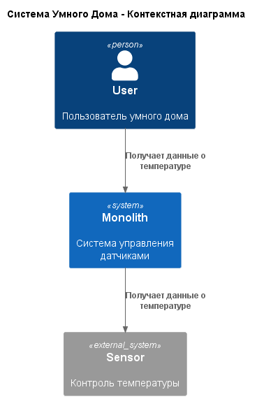
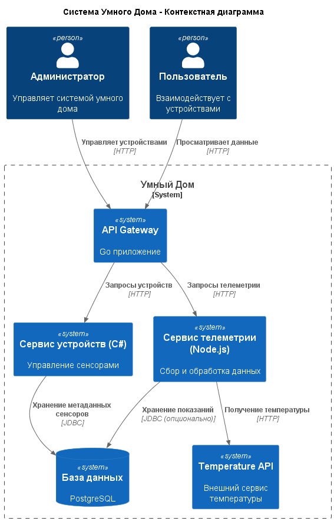
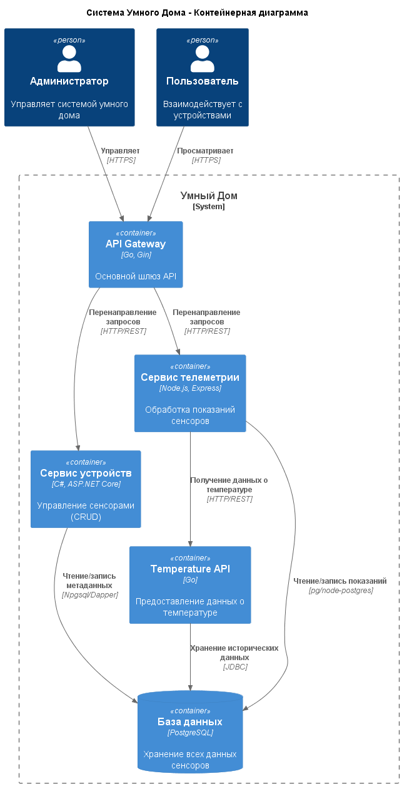
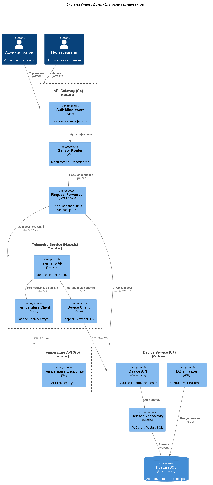
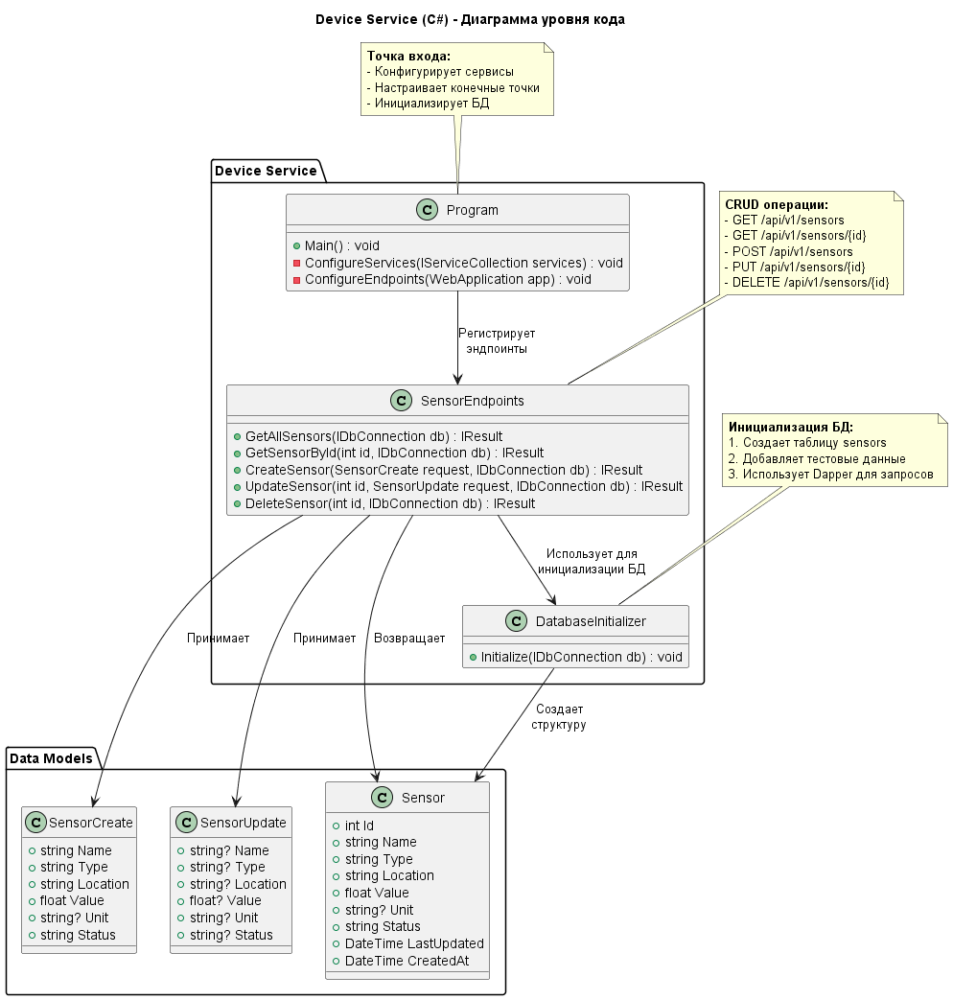
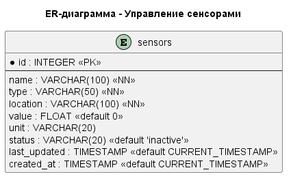

# Project_template

## Задание 1. Анализ и планирование

### 1. Описание функциональности монолитного приложения
Система SmartHome предоставляет комплексное решение для управления датчиками в умном доме с акцентом на температурные датчики:

**Управление устройствами:**
- Регистрация новых датчиков (с указанием типа, местоположения, характеристик)
- Просмотр списка всех зарегистрированных датчиков
- Обновление метаданных датчиков (название, местоположение, статус)
- Удаление датчиков из системы
- Управление статусом датчиков (активный/неактивный)

**Мониторинг телеметрии:**
- Получение текущих показаний с датчиков
- Обновление значений датчиков в реальном времени
- Исторический просмотр изменений показаний
- Интеграция с внешними источниками данных о температуре
- Автоматическое обновление температурных данных из внешнего API

**Температурный мониторинг:**
- Запрос температуры по конкретному местоположению
- Автоматическое сопоставление местоположений с идентификаторами датчиков
- Генерация реалистичных температурных данных
- Валидация и нормализация входных параметров

### 2. Анализ архитектуры монолитного приложения
**Технологический стек:**
- Язык программирования: Go (Gin framework)
- База данных: PostgreSQL
- Протокол взаимодействия: HTTP/REST

**Архитектурные особенности:**
- Монолитная структура: все компоненты в единой кодовой базе
- Прямое взаимодействие с БД: отсутствие абстракции доступа к данным
- Синхронная интеграция с внешними сервисами
- Отсутствие разделения ответственности между доменами
- Единый процесс развертывания и масштабирования

**Ограничения текущей реализации:**
- Высокая связанность компонентов
- Сложность внедрения новых типов датчиков
- Риск каскадных сбоев
- Ограниченные возможности горизонтального масштабирования
- Длительное время развертывания изменений

### 3. Определение доменов и границы контекстов
Выделены три основных домена с четкими границами ответственности:

1. **Управление устройствами (Device Management):**
   - Регистрация и каталогизация датчиков
   - Хранение метаданных (название, тип, местоположение)
   - Управление жизненным циклом устройств
   - Граница: CRUD операции для сущности "Датчик"

2. **Мониторинг телеметрии (Telemetry Monitoring):**
   - Сбор и обработка показаний с датчиков
   - Хранение текущих значений
   - Интеграция с внешними источниками данных
   - Граница: Операции со значениями датчиков

3. **Температурная аналитика (Temperature Analytics):**
   - Предоставление данных о температуре
   - Нормализация и генерация температурных данных
   - Сопоставление местоположений с датчиками
   - Граница: API для получения температурных данных

### 4. Проблемы монолитного решения
**Текущие ограничения:**
1. **Сложность внедрения изменений:** Любое изменение требует полного переразвертывания системы
2. **Отсутствие технологической гибкости:** Невозможно использовать оптимальные технологии для разных задач
3. **Проблемы с надежностью:** Ошибка в одном модуле может привести к падению всей системы
4. **Ограниченное масштабирование:** Нельзя масштабировать ресурсоемкие части системы независимо
5. **Высокий порог входа:** Новым разработчикам сложно разобраться в большой кодовой базе

**Будущие риски:**
- Невозможность эффективно добавлять новые типы датчиков
- Трудности интеграции с IoT-платформами
- Ограничения производительности при росте нагрузки
- Сложности с реализацией сложных аналитических функций

### 5. Визуализация контекста системы — диаграмма С4


**Описание:**
- Администратор и Пользователь взаимодействуют с монолитным приложением
- Приложение напрямую работает с PostgreSQL
- Интеграция с внешним Temperature API
- Отсутствие разделения на сервисы

---

## Задание 2. Проектирование микросервисной архитектуры

### Стратегия разбиения
Монолит разделен на четыре независимых микросервиса:
1. **API Gateway (Go):** Единая точка входа, маршрутизация запросов
2. **Device Service (C#):** Управление метаданными датчиков
3. **Telemetry Service (Node.js):** Обработка показаний датчиков
4. **Temperature API (Go):** Предоставление температурных данных

**Ключевые решения:**
- Каждый сервис имеет собственную зону ответственности
- Слабая связанность через четкие API контракты
- Возможность независимого развертывания и масштабирования
- Использование оптимальных технологий для задач

### Диаграмма контекста (Context)


**Изменения:**
- Добавлены микросервисы вместо монолита
- Четкое разделение потоков данных
- API Gateway как единая точка входа

### Диаграмма контейнеров (Containers)


**Компоненты:**
1. API Gateway: Go приложение
2. Device Service: C# микросервис
3. Telemetry Service: Node.js микросервис
4. Temperature API: Go сервис
5. PostgreSQL: Единое хранилище данных

### Диаграмма компонентов (Components)


**Детализация:**
- Для каждого сервиса показаны внутренние компоненты
- Взаимодействие через HTTP API
- Разделение ответственности между компонентами

### Диаграмма кода (Code)


**Особенности:**
- Модель данных для Device Service
- Взаимосвязи между классами
- Принципы работы репозитория

---

## Задание 3. Разработка ER-диаграммы


**Сущность sensors:**
- `id`: Уникальный идентификатор (первичный ключ)
- `name`: Название датчика
- `type`: Тип датчика (Temperature, Humidity, Motion)
- `location`: Физическое расположение
- `value`: Текущее значение
- `unit`: Единица измерения
- `status`: Текущий статус (active, inactive, warning)
- `last_updated`: Время последнего обновления
- `created_at`: Время создания

**Нормализация:**
- Все атрибуты атомарны
- Отсутствие избыточности данных
- Оптимальные типы данных

---

## Задание 4. Создание и документирование API

### 1. Тип API
**Выбрана синхронная HTTP/REST коммуникация:**

**Обоснование:**
1. **Характер операций:** Большинство операций требуют немедленного ответа
2. **Простота реализации:** Минимальные накладные расходы для текущего масштаба
3. **Прямая согласованность:** Гарантия актуальности данных после операций
4. **Технологическая зрелость:** Широкая поддержка инструментов и библиотек
5. **Отладка и мониторинг:** Упрощенная трассировка запросов

**Преимущества для данной системы:**
- Низкая латентность для пользовательских операций
- Отсутствие дополнительных зависимостей (брокеров сообщений)
- Прозрачность взаимодействия между сервисами
- Быстрая разработка и интеграция

### 2. Документация API
[Полная спецификация OpenAPI 3.0](./swagger.yaml)

**Ключевые разделы документации:**
1. Управление датчиками (Device Service)
2. Работа с показаниями (Telemetry Service)
3. Температурные данные (Temperature API)
4. Проверки работоспособности

**Особенности:**
- Интерактивная документация через Swagger UI
- Примеры запросов и ответов
- Детальное описание ошибок
- Автоматическая валидация параметров

---

## Задание 5. Работа с docker и docker-compose

**Реализовано:**
1. **Temperature API:**
   - Go-приложение на порту 8081
   - Генерация реалистичных температурных данных
   - Автоматическое сопоставление местоположений и ID датчиков
   - Dockerfile для упаковки приложения

2. **PostgreSQL:**
   - Версия 16-alpine
   - Автоматическая инициализация через init.sql
   - Настройки здоровья контейнера
   - Том для сохранения данных

3. **Интеграция в docker-compose:**
   - Сеть smarthome-network для взаимодействия
   - Зависимости между сервисами
   - Переменные окружения для настройки
   - Проброс портов для доступа с хоста

**Проверка работоспособности:**
1. Создание датчика через Postman
2. Получение списка всех датчиков
3. Проверка изменения температурных показаний
4. Запрос температуры по местоположению

---

## Задание 6. Разработка MVP

### Реализованные микросервисы

**1. Device Service (C#):**
- **Технологии:** ASP.NET Core, Dapper, Npgsql
- **Функционал:**
  - CRUD операции для датчиков
  - Инициализация БД при запуске
  - Валидация входных данных
  - Интеграция с PostgreSQL
- **Dockerfile:** Многоступенчатая сборка

**2. Telemetry Service (Node.js):**
- **Технологии:** Express.js, Axios, PostgreSQL
- **Функционал:**
  - Обновление показаний датчиков
  - Получение данных от Temperature API
  - Обогащение данных метаданными
  - Обработка ошибок
- **Dockerfile:** Оптимизированный образ

### Интеграция с монолитом
**Стратегия перехода:**
1. **Фасад (API Gateway):** Перенаправление запросов
2. **Параллельная работа:** Монолит и микросервисы работают одновременно
3. **Постепенный перенос функционала:**
   - Сначала Device Service берет на себя CRUD операции
   - Затем Telemetry Service берет обработку показаний
   - Монолит остается как координатор

**Реализованные интеграции:**
1. API Gateway → Device Service (HTTP)
2. API Gateway → Telemetry Service (HTTP)
3. Telemetry Service → Device Service (HTTP)
4. Telemetry Service → Temperature API (HTTP)
5. Все сервисы → PostgreSQL (Npgsql/pg)

### Docker-инфраструктура
**Особенности реализации:**
1. Единая сеть smarthome-network
2. Healthcheck для критических сервисов
3. Зависимости между сервисами
4. Переменные окружения для конфигурации
5. Тома данных для PostgreSQL

**Запуск системы:**
```bash
docker-compose up --build
```